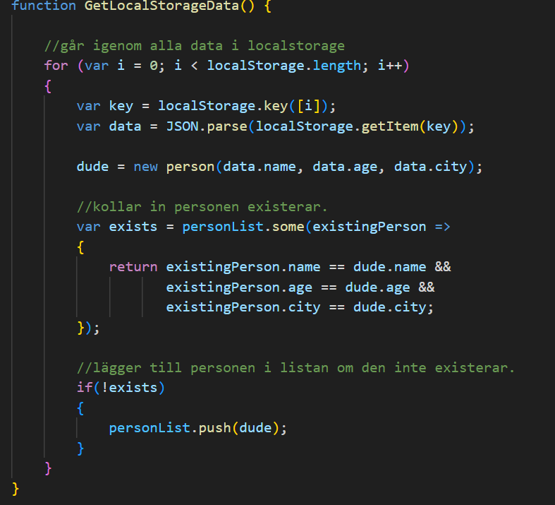

Detta var en inlämningar uppgift för att öva HTML, CSS och JavaScript.
Jag lärde mig land annat att använda mig av grids för att skapa struktur men ochså hur faktiskt JavaScrpit funkar.
En lärdom jag drog var att strukturen på sidan kan förenkla mycket små problem som kommer senare och att öven börja med mobile-first
under utveckling av webbsidor.

